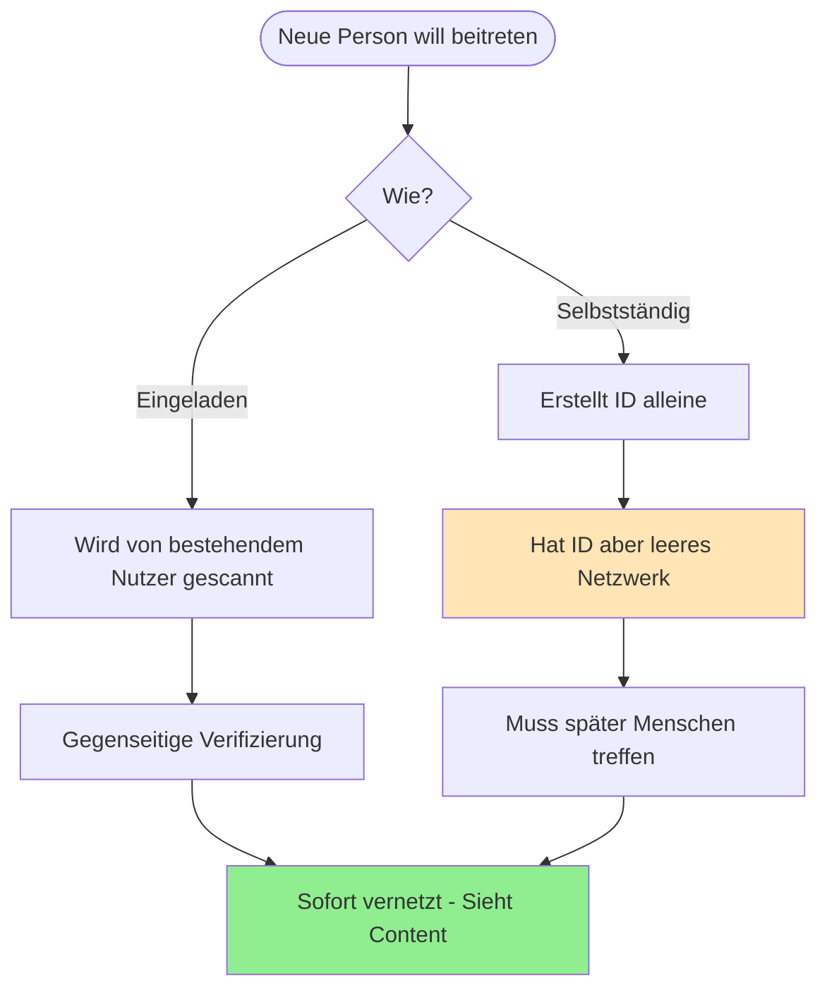
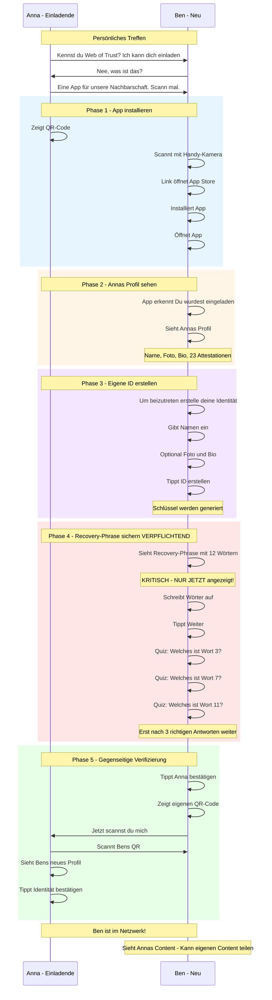
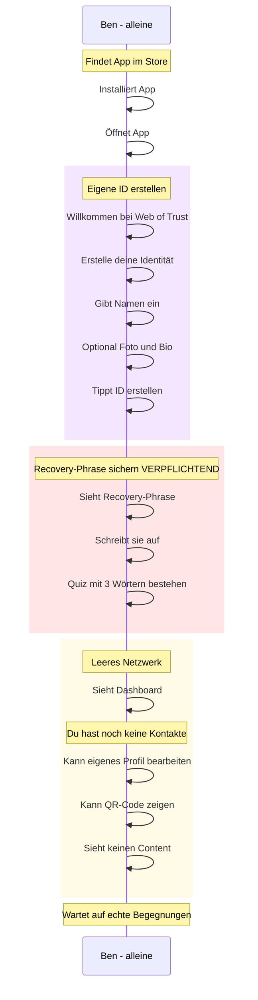
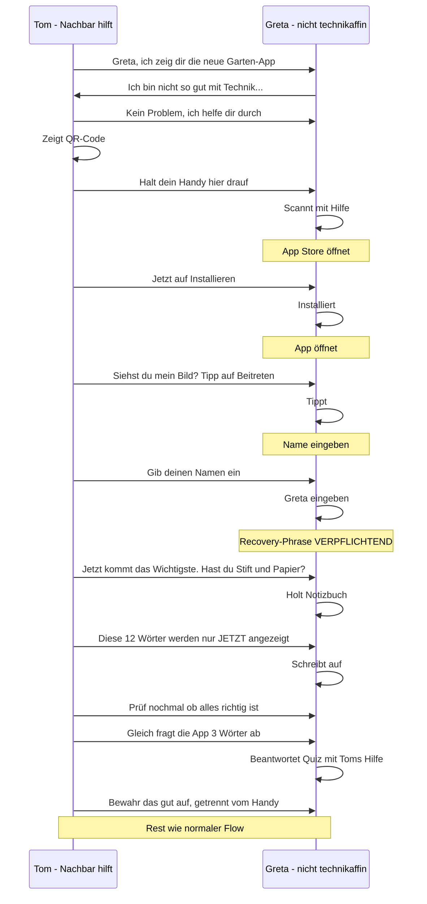
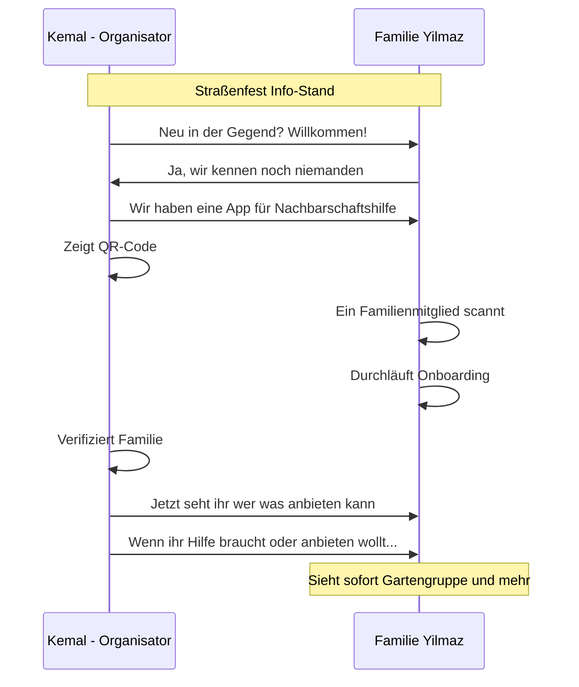
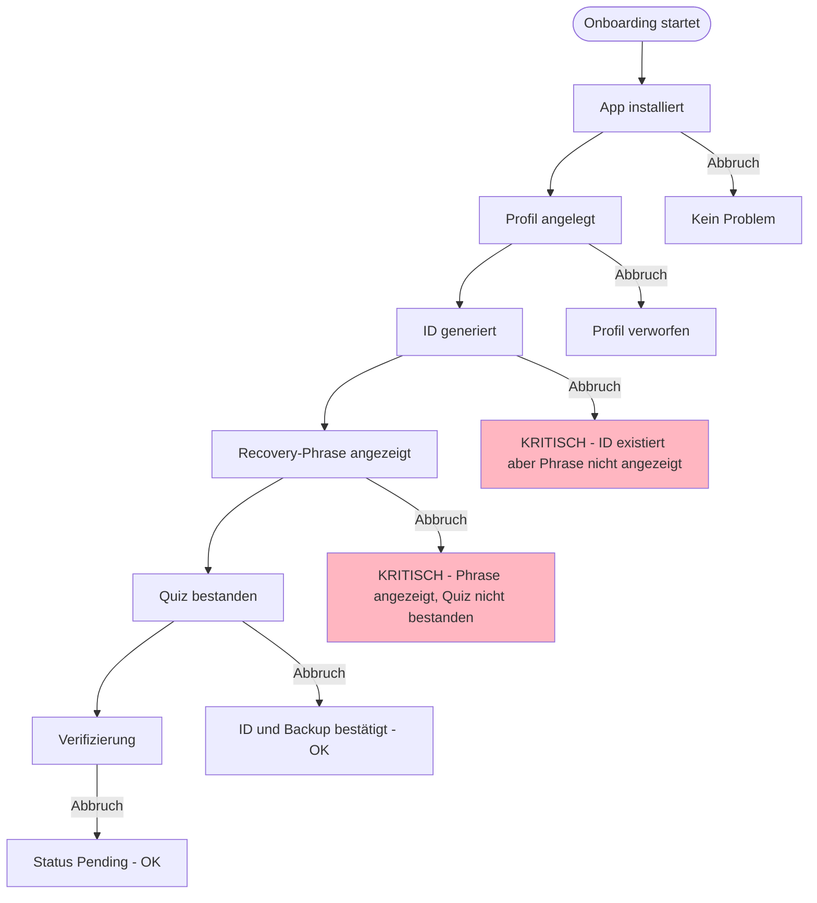

# Onboarding-Flow (Nutzer-Perspektive)

> Wie ein neuer Nutzer ins Netzwerk kommt

## Übersicht: Zwei Wege ins Netzwerk



## Hauptflow: Onboarding durch Einladung



## Variante: Selbstständiges Onboarding



## Was der Nutzer sieht

### Willkommens-Screen (eingeladen)

```
┌─────────────────────────────────┐
│                                 │
│      🌐 Web of Trust            │
│                                 │
│   Du wurdest eingeladen von:    │
│                                 │
│         📷 [Profilbild]         │
│          Anna Müller            │
│                                 │
│   "Aktiv im Gemeinschafts-      │
│    garten Sonnenberg"           │
│                                 │
│   ✅ 23 Attestationen           │
│   ✅ 47 Verifizierungen         │
│                                 │
├─────────────────────────────────┤
│                                 │
│   [ Jetzt beitreten ]           │
│                                 │
│   Was ist Web of Trust? ℹ️       │
│                                 │
└─────────────────────────────────┘
```

### Profil erstellen

```
┌─────────────────────────────────┐
│                                 │
│   Erstelle dein Profil          │
│                                 │
│   ┌─────────────────────────┐   │
│   │                         │   │
│   │     📷 Foto hinzufügen  │   │
│   │       (optional)        │   │
│   │                         │   │
│   └─────────────────────────┘   │
│                                 │
│   Name *                        │
│   ┌─────────────────────────┐   │
│   │ Ben Schmidt             │   │
│   └─────────────────────────┘   │
│                                 │
│   Über mich (optional)          │
│   ┌─────────────────────────┐   │
│   │ Neu in der Gegend,      │   │
│   │ interessiert an...      │   │
│   └─────────────────────────┘   │
│                                 │
│   [ Weiter ]                    │
│                                 │
└─────────────────────────────────┘
```

### Recovery-Phrase (VERPFLICHTEND)

```
┌─────────────────────────────────┐
│                                 │
│   🔐 Deine Recovery-Phrase      │
│                                 │
│   ⚠️  WICHTIG - LIES DAS!       │
│                                 │
│   Diese 12 Wörter werden dir    │
│   NUR JETZT angezeigt.          │
│   Sie können NICHT erneut       │
│   abgerufen werden!             │
│                                 │
│   ┌─────────────────────────┐   │
│   │                         │   │
│   │  1. apple    7. forest  │   │
│   │  2. banana   8. garden  │   │
│   │  3. cherry   9. house   │   │
│   │  4. delta   10. iron    │   │
│   │  5. echo    11. jungle  │   │
│   │  6. frog    12. kite    │   │
│   │                         │   │
│   └─────────────────────────┘   │
│                                 │
│   📝 Schreib sie JETZT auf      │
│   🚫 Mach keinen Screenshot     │
│   🔒 Bewahre sie sicher auf     │
│                                 │
│   [ Weiter zum Quiz ]           │
│                                 │
└─────────────────────────────────┘
```

### Phrase verifizieren (VERPFLICHTEND)

```
┌─────────────────────────────────┐
│                                 │
│   Bestätige deine Sicherung     │
│                                 │
│   Welches ist Wort Nummer 4?    │
│                                 │
│   ┌─────────┐ ┌─────────┐       │
│   │  delta  │ │  echo   │       │
│   └─────────┘ └─────────┘       │
│   ┌─────────┐ ┌─────────┐       │
│   │  frog   │ │  apple  │       │
│   └─────────┘ └─────────┘       │
│                                 │
│   ━━━━━━━━━━━━━━━━━━━━━━━━━━━   │
│   Frage 1 von 3                 │
│                                 │
└─────────────────────────────────┘
```

Bei falscher Antwort:

```
┌─────────────────────────────────┐
│                                 │
│   ❌ Leider falsch              │
│                                 │
│   Wort 4 ist "delta"            │
│                                 │
│   Bitte prüfe deine Notizen     │
│   und versuche es erneut.       │
│                                 │
│   [ Zurück zur Phrase ]         │
│                                 │
└─────────────────────────────────┘
```

### Erster Kontakt bestätigen

```
┌─────────────────────────────────┐
│                                 │
│   ✅ Deine ID wurde erstellt!   │
│                                 │
│   Jetzt noch Anna bestätigen:   │
│                                 │
│         📷 [Annas Bild]         │
│          Anna Müller            │
│                                 │
│   Ist das die Person, die       │
│   dir gerade gegenübersteht?    │
│                                 │
│   [ Ja, Identität bestätigen ]  │
│                                 │
│   [ Nein, abbrechen ]           │
│                                 │
└─────────────────────────────────┘
```

### QR-Code zeigen

```
┌─────────────────────────────────┐
│                                 │
│   Fast geschafft!               │
│                                 │
│   Zeig Anna diesen Code:        │
│                                 │
│   ┌─────────────────────────┐   │
│   │                         │   │
│   │      ▄▄▄▄▄▄▄▄▄▄▄       │   │
│   │      █ QR-CODE █       │   │
│   │      █         █       │   │
│   │      ▀▀▀▀▀▀▀▀▀▀▀       │   │
│   │                         │   │
│   └─────────────────────────┘   │
│                                 │
│   Ben Schmidt                   │
│   did:wot:b3n5chm1dt...        │
│                                 │
│   "Jetzt scannst du mich"       │
│                                 │
└─────────────────────────────────┘
```

### Willkommen im Netzwerk

```
┌─────────────────────────────────┐
│                                 │
│   🎉 Willkommen im Netzwerk!    │
│                                 │
│   Du bist jetzt verbunden mit:  │
│                                 │
│   👩 Anna Müller                │
│                                 │
├─────────────────────────────────┤
│                                 │
│   Nächste Schritte:             │
│                                 │
│   📅 Annas Termine ansehen      │
│                                 │
│   🗺️  Orte in der Nähe          │
│                                 │
│   👥 Mehr Menschen treffen      │
│                                 │
│   [ Los geht's ]                │
│                                 │
└─────────────────────────────────┘
```

## Personas im Onboarding

### Greta (62) - braucht Hilfe



### Familie Yilmaz - Straßenfest



## Edge Cases

### Abbruch während Onboarding



**Wichtig:** 
- Nach Schritt 3 (ID generiert) blockiert die App das Schließen/Zurückgehen
- Der Nutzer MUSS das Quiz bestehen um fortzufahren
- Bei Abbruch während Phrase-Anzeige oder Quiz: App zeigt beim nächsten Start die Phrase erneut an und fordert Quiz-Abschluss

### Quiz nicht bestanden

Wenn der Nutzer eine falsche Antwort gibt:

1. Fehlermeldung mit korrekter Antwort
2. Zurück zur Phrase-Anzeige
3. Quiz startet von vorne mit neuen zufälligen Wort-Positionen

Es gibt **keine Möglichkeit**, das Quiz zu überspringen.
