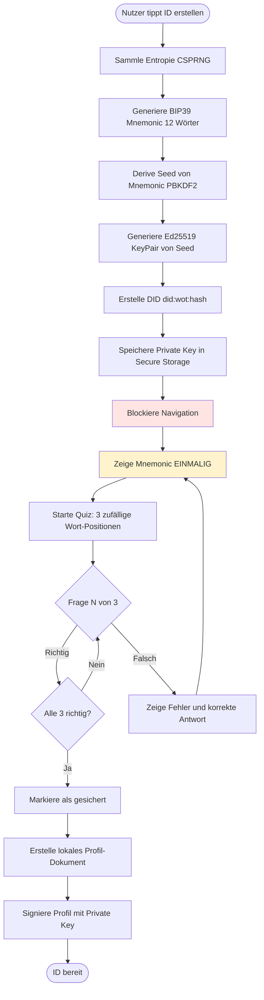
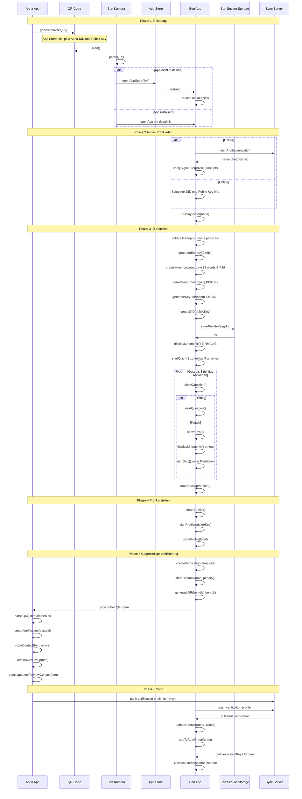
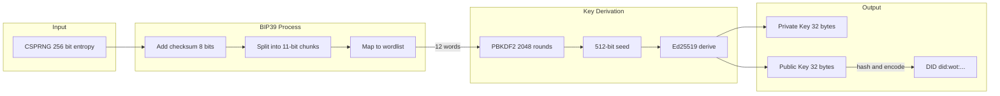
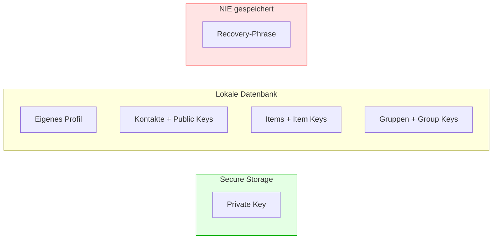
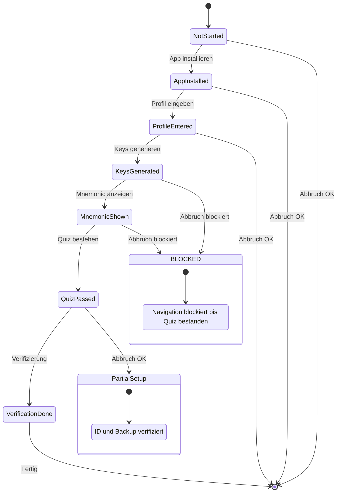
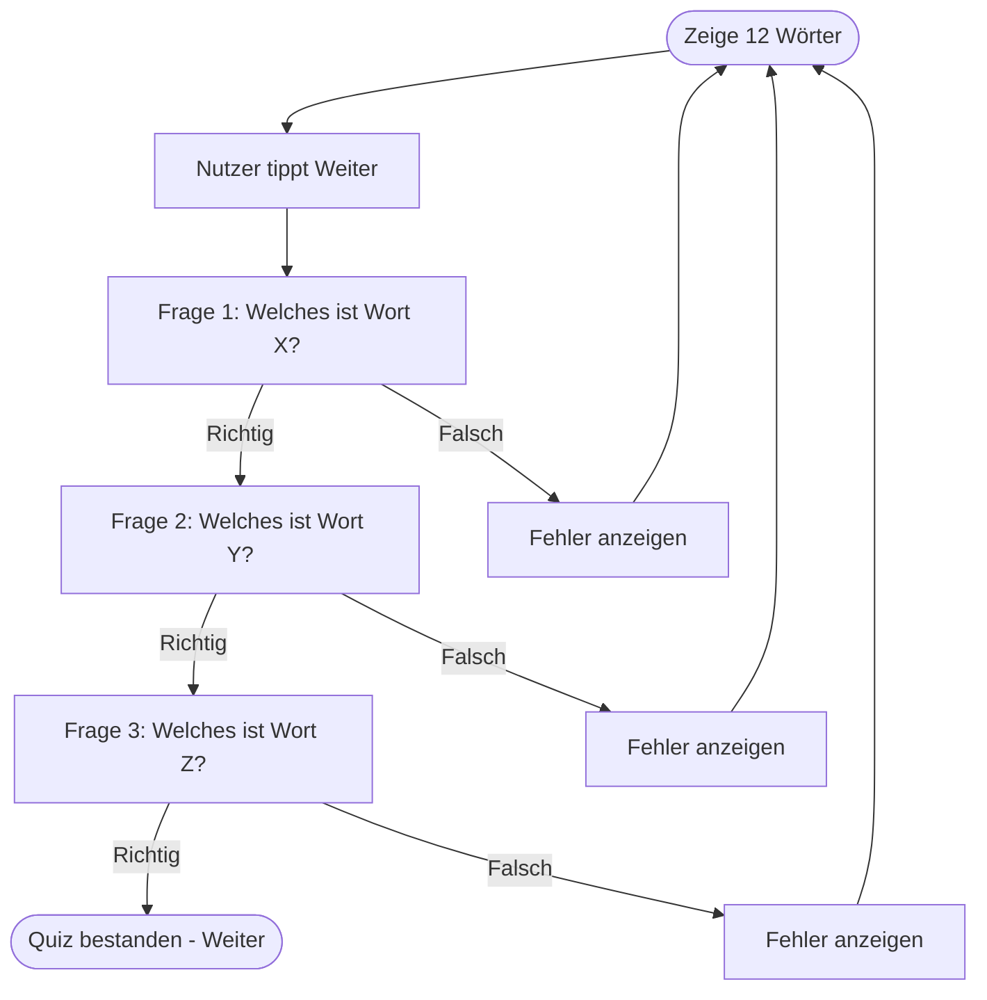
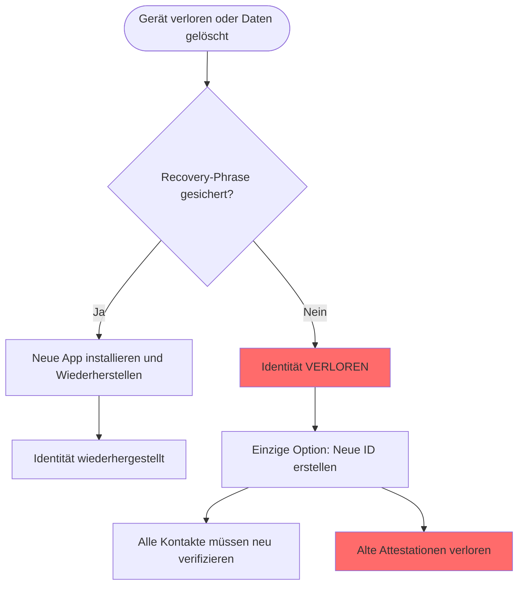

# Onboarding-Flow (Technische Perspektive)

> Wie eine neue Identität erstellt und ins Netzwerk integriert wird

## Detailflow: ID-Erstellung



## Sequenzdiagramm: Vollständiges Onboarding



## Kryptographische Details

### Key Generation



### DID Structure

```
did:wot:7Hy3kPqR9mNx2Wb5vLz8
     │   └──────────────────── Base58 encoded
     │                         first 16 bytes of
     │                         SHA256(publicKey)
     └────────────────────────── Method name
```

### Profil-Signatur

```json
{
  "@context": "https://w3id.org/weboftrust/v1",
  "type": "Profile",
  "id": "did:wot:7Hy3kPqR9mNx2Wb5vLz8",
  "name": "Ben Schmidt",
  "photo": "ipfs://Qm...",
  "bio": "Neu in der Gegend",
  "publicKey": {
    "type": "Ed25519VerificationKey2020",
    "publicKeyMultibase": "z6Mkf..."
  },
  "updated": "2025-01-08T14:30:00Z",
  "proof": {
    "type": "Ed25519Signature2020",
    "verificationMethod": "did:wot:7Hy3kPqR9mNx2Wb5vLz8#key-1",
    "proofPurpose": "assertionMethod",
    "proofValue": "z58DAdFfa9..."
  }
}
```

## Invite-QR vs. Standard-QR

### Standard-QR (für bestehende Nutzer)

```json
{
  "type": "wot-identity",
  "did": "did:wot:anna123",
  "pk": "ed25519:base64..."
}
```

### Invite-QR (für Onboarding)

```json
{
  "type": "wot-invite",
  "app": "https://weboftrust.app/download",
  "did": "did:wot:anna123",
  "pk": "ed25519:base64...",
  "token": "optional-invite-token"
}
```

Das `token` könnte für Analytics oder spezielle Invite-Flows genutzt werden.

## Secure Storage

### Platform-spezifisch

| Platform | Storage | Details |
|----------|---------|---------|
| iOS | Keychain | kSecClassKey, Hardware-backed wenn verfügbar |
| Android | Keystore | AndroidKeyStore, TEE/Strongbox wenn verfügbar |
| Web | Web Crypto API + IndexedDB | extractable: false, Key nie als Raw exportierbar |

### Web Crypto API Details

```javascript
// Non-extractable Key generieren
const keyPair = await crypto.subtle.generateKey(
  { name: "Ed25519" },
  false,  // extractable = false
  ["sign", "verify"]
);

// In IndexedDB speichern (CryptoKey-Objekt direkt)
const db = await openDB('wot-keys', 1);
await db.put('keys', keyPair.privateKey, 'privateKey');
await db.put('keys', keyPair.publicKey, 'publicKey');

// Key kann nur für sign/verify verwendet werden
const signature = await crypto.subtle.sign(
  { name: "Ed25519" },
  keyPair.privateKey,
  data
);
```

### Web-spezifische Risiken

| Risiko | Mitigation |
|--------|------------|
| Browserdaten löschen löscht Keys | Recovery-Phrase ist EINZIGER Weg zurück |
| Kein Cross-Device Sync | Nutzer muss auf jedem Gerät recovern |
| Browser-Update könnte brechen | Unwahrscheinlich, aber Monitoring nötig |

**Konsequenz:** Recovery-Phrase-Sicherung ist im Web noch kritischer als bei nativen Apps!

### Was wird gespeichert



| Speicherort | Inhalt | Details |
|-------------|--------|---------|
| **Secure Storage** | Private Key | Non-extractable auf Web (Web Crypto API) |
| **Lokale Datenbank** | Profil, Kontakte, Items, Gruppen | Verschlüsselt mit Device Key |
| **NIE gespeichert** | Recovery-Phrase (12 Wörter) | Wird NUR EINMAL bei ID-Erstellung angezeigt |

**KRITISCH:** Die Recovery-Phrase wird nirgendwo gespeichert. Sie wird **exakt einmal** bei der ID-Erstellung angezeigt. Der Nutzer MUSS das Quiz bestehen um fortzufahren - es gibt keine ungesicherten Accounts.

## Fehlerbehandlung

### Onboarding-Abbruch



### Quiz-Ablauf im Detail



**Wichtig:**
- X, Y, Z sind zufällige Positionen (1-12)
- Bei jedem Neustart werden neue Positionen gewählt
- Multiple-Choice mit 4 Optionen (1 richtig, 3 falsch aus der Wortliste)
- Kein Überspringen möglich

## Sicherheitsüberlegungen

### Threat Model

| Threat | Mitigation |
|--------|------------|
| Mnemonic abfotografiert | Warnung Kein Screenshot plus OS-Screenshot-Schutz |
| Shoulder Surfing | Privater Raum empfohlen |
| Malware auf Gerät | Secure Storage / Web Crypto nutzt Hardware-Isolation |
| Server-Kompromittierung | Private Key verlässt nie das Gerät |
| QR-Code-Fälschung | Profil ist signiert, Fälschung erkennbar |
| Browser-Daten gelöscht Web | Recovery über Mnemonic - einziger Weg! |

### Best Practices

1. **Mnemonic NUR EINMAL anzeigen** - Wird nirgendwo gespeichert
2. **Quiz ist VERPFLICHTEND** - Kein Fortfahren ohne 3 richtige Antworten
3. **Navigation blockieren** - Zwischen Key-Generierung und Quiz-Abschluss
4. **Kein Cloud-Backup des Keys** - Nur Mnemonic auf Papier
5. **Biometrie optional** - Für App-Entsperrung, nicht für Key-Zugriff

### Recovery-Szenario


