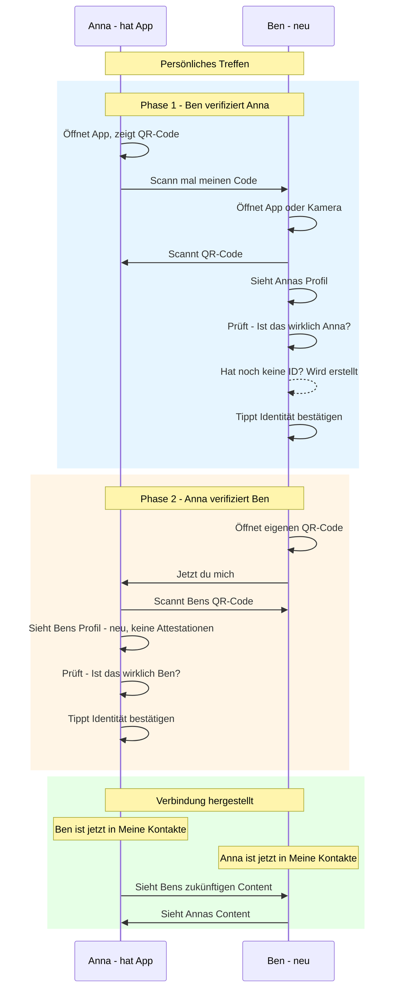
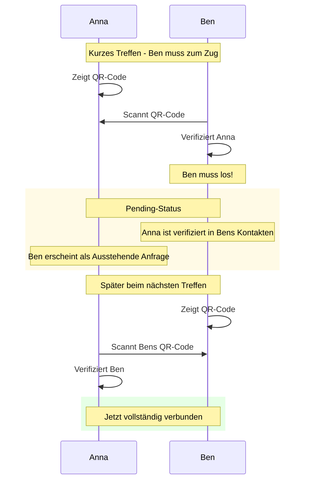
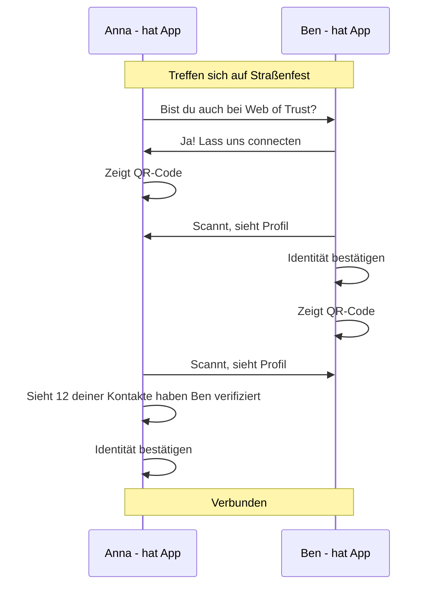

# Verifizierungs-Flow (Nutzer-Perspektive)

> Was Anna und Ben erleben

## Hauptflow: Gegenseitige Verifizierung



## Variante: Nur einseitige Verifizierung - Pending



## Variante: Beide haben schon die App



## Was der Nutzer sieht

### Beim Scannen (Online)

```
┌─────────────────────────────────┐
│                                 │
│         📷 [Profilbild]         │
│                                 │
│          Anna Müller            │
│                                 │
│   "Aktiv im Gemeinschafts-      │
│    garten Sonnenberg"           │
│                                 │
├─────────────────────────────────┤
│ ✅ 12 deiner Kontakte haben     │
│    diese Person verifiziert     │
├─────────────────────────────────┤
│                                 │
│   [ Identität bestätigen ]      │
│                                 │
│   [ Abbrechen ]                 │
│                                 │
└─────────────────────────────────┘
```

### Beim Scannen (Offline)

```
┌─────────────────────────────────┐
│                                 │
│         ⚠️ Offline              │
│                                 │
│   Profil kann nicht geladen     │
│   werden.                       │
│                                 │
├─────────────────────────────────┤
│                                 │
│   ID-Prüfwert:                  │
│   ┌─────────────────────────┐   │
│   │  a7f3-82b1-c9d4-e5f6    │   │
│   └─────────────────────────┘   │
│                                 │
│   Frage dein Gegenüber:         │
│   "Was zeigt deine App als      │
│    ID-Prüfwert an?"             │
│                                 │
├─────────────────────────────────┤
│                                 │
│   [ Identität bestätigen ]      │
│                                 │
│   [ Abbrechen ]                 │
│                                 │
└─────────────────────────────────┘
```

### Kontaktliste danach

```
┌─────────────────────────────────┐
│  Meine Kontakte                 │
├─────────────────────────────────┤
│                                 │
│  👩 Anna Müller          ✅     │
│     Verifiziert am 08.01.25     │
│                                 │
│  👨 Ben Schmidt          ✅     │
│     Verifiziert am 08.01.25     │
│                                 │
│  👴 Tom Wagner           ✅     │
│     Verifiziert am 03.01.25     │
│                                 │
├─────────────────────────────────┤
│  Ausstehend                     │
├─────────────────────────────────┤
│                                 │
│  👩 Carla Braun          ⏳     │
│     Wartet auf Bestätigung      │
│                                 │
└─────────────────────────────────┘
```
