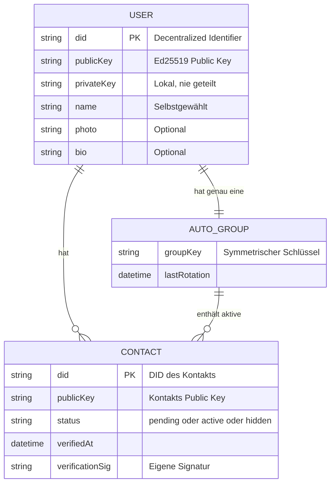
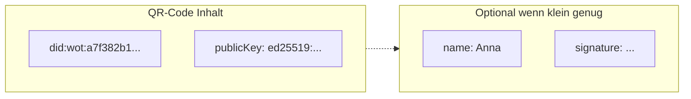
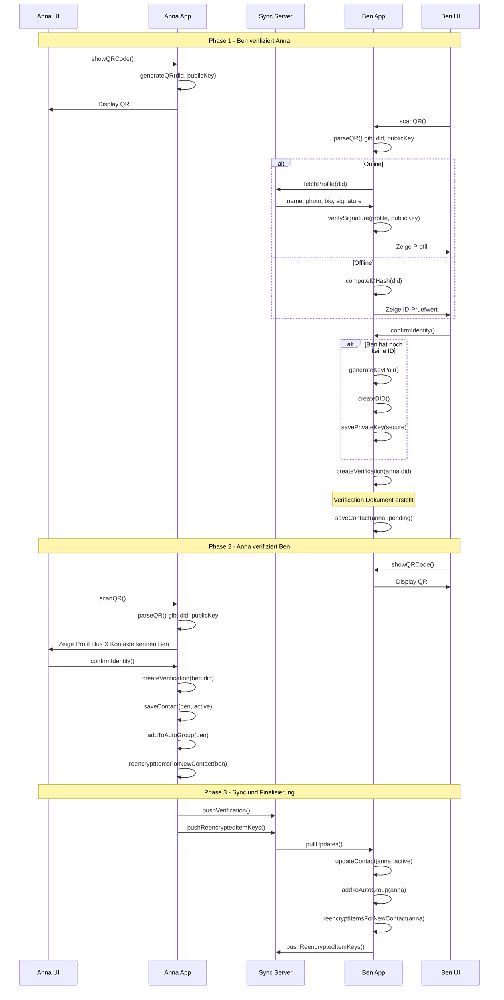
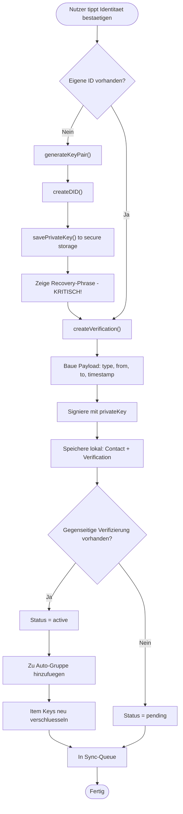
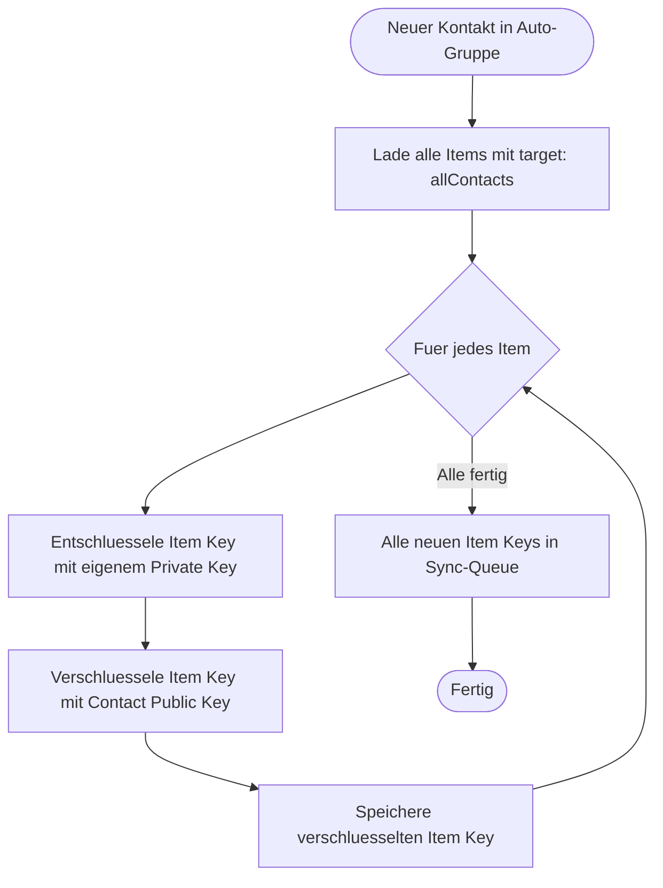
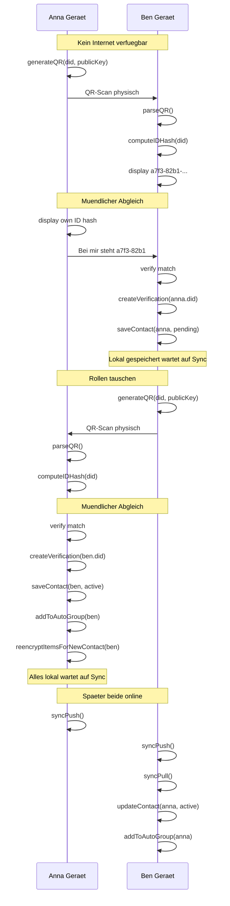
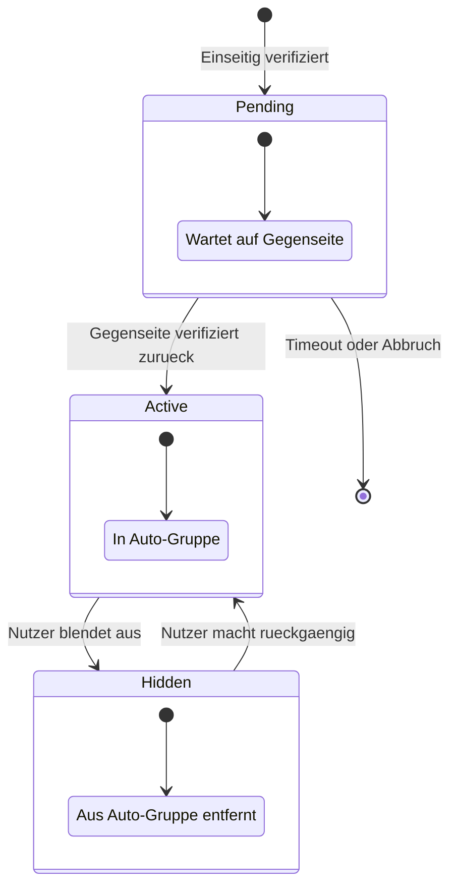

# Verifizierungs-Flow (Technische Perspektive)

> Was die Geräte und das System tun

## Datenmodell



## QR-Code Struktur



**Minimal (druckfreundlich):**
```json
{
  "did": "did:wot:a7f382b1c9d4e5f6",
  "pk": "ed25519:base64encodedkey..."
}
```

**Erweitert (digitaler QR):**
```json
{
  "did": "did:wot:a7f382b1c9d4e5f6",
  "pk": "ed25519:base64encodedkey...",
  "name": "Anna Müller",
  "sig": "signatur_des_payloads"
}
```

## Hauptflow: Gegenseitige Verifizierung



## Detailflow: Verifizierung erstellen



## Detailflow: Item Keys neu verschlüsseln



## Detailflow: Offline-Verifizierung



## Zustandsdiagramm: Kontakt-Status



### Kontakt-Status Details

| Status | In Auto-Gruppe | Sieht Content | Erhaelt Item Keys |
|--------|----------------|---------------|-------------------|
| Pending | Nein | Nein | Nein |
| Active | Ja | Ja (neuen) | Ja |
| Hidden | Nein | Nein (neuen) | Nein, alte noch lesbar |

## Datenstrukturen

### Verification Document

```json
{
  "@context": "https://w3id.org/weboftrust/v1",
  "type": "IdentityVerification",
  "id": "urn:uuid:123e4567-e89b-12d3-a456-426614174000",
  "from": "did:wot:anna123",
  "to": "did:wot:ben456",
  "timestamp": "2025-01-08T14:30:00Z",
  "proof": {
    "type": "Ed25519Signature2020",
    "verificationMethod": "did:wot:anna123#key-1",
    "proofValue": "z58DAdFfa9SkqZMVPxAQpic7ndTEcnUn..."
  }
}
```

### Contact Record (lokal)

```json
{
  "did": "did:wot:ben456",
  "publicKey": "ed25519:base64...",
  "name": "Ben Schmidt",
  "status": "active",
  "verifiedAt": "2025-01-08T14:30:00Z",
  "myVerification": "urn:uuid:123e4567-...",
  "theirVerification": "urn:uuid:789abcde-..."
}
```

### Auto-Group (lokal)

```json
{
  "id": "urn:uuid:autogroup-anna",
  "type": "AutoContactGroup",
  "groupKey": "aes256:encrypted_with_own_pubkey...",
  "members": [
    "did:wot:ben456",
    "did:wot:carla789"
  ],
  "lastKeyRotation": "2025-01-08T14:30:00Z"
}
```
