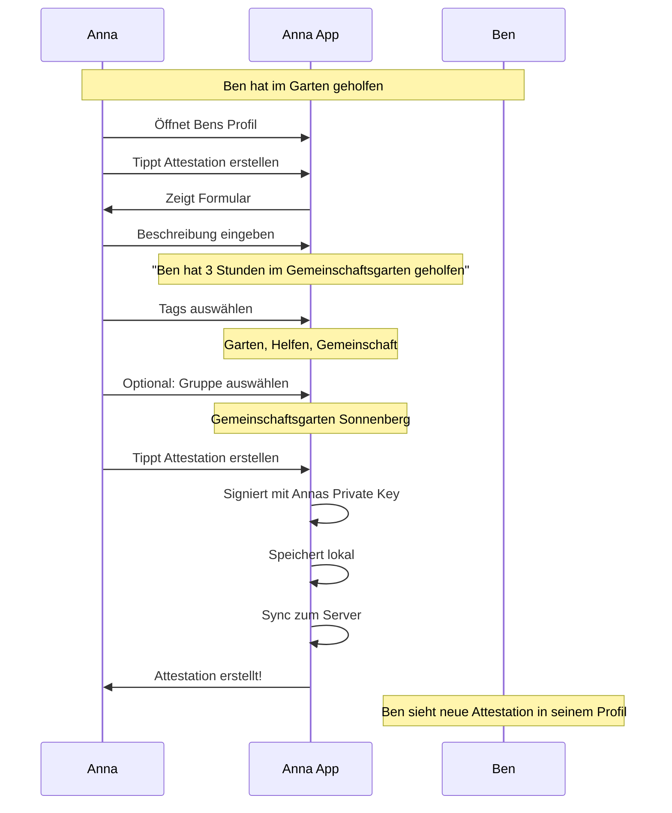
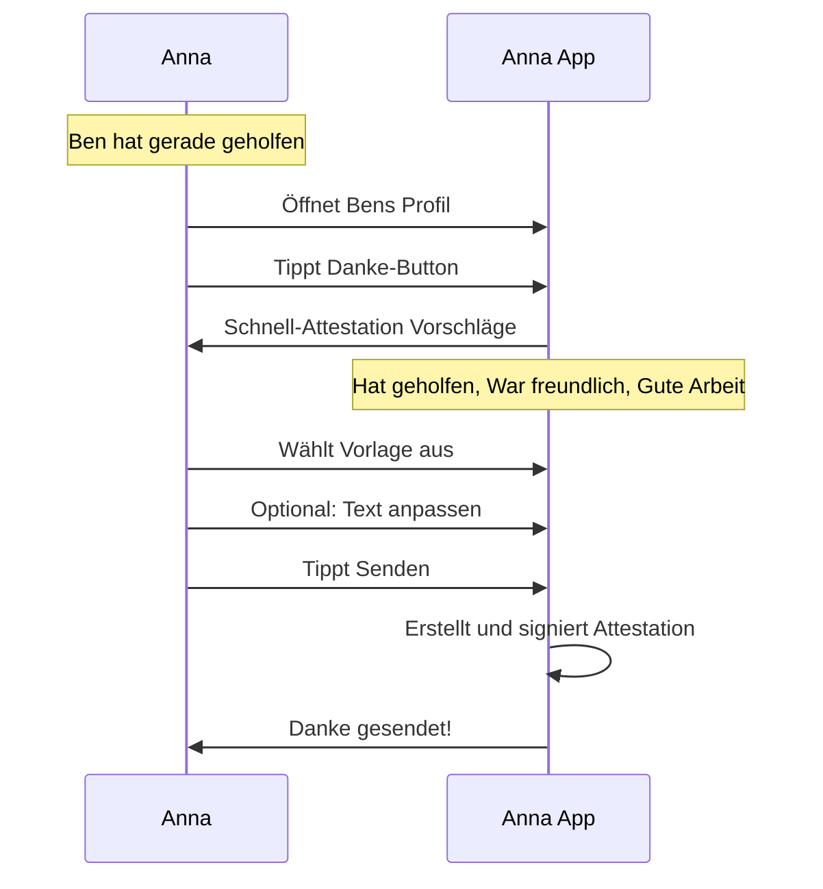
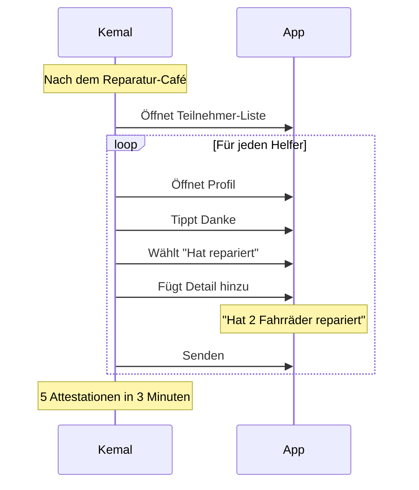
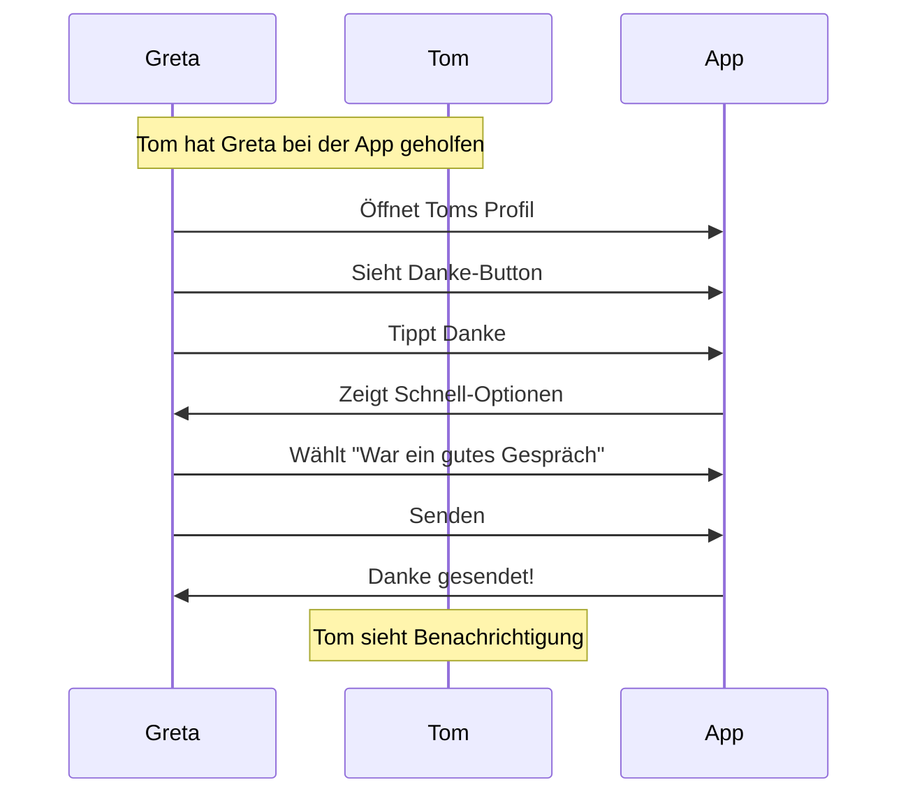
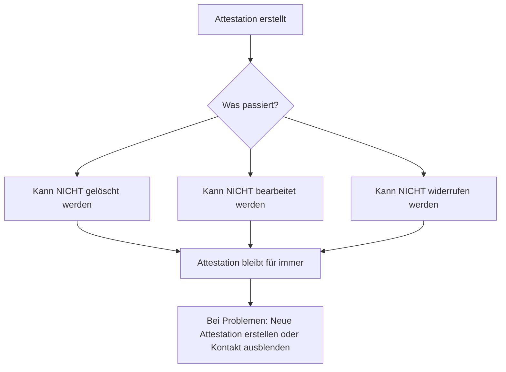
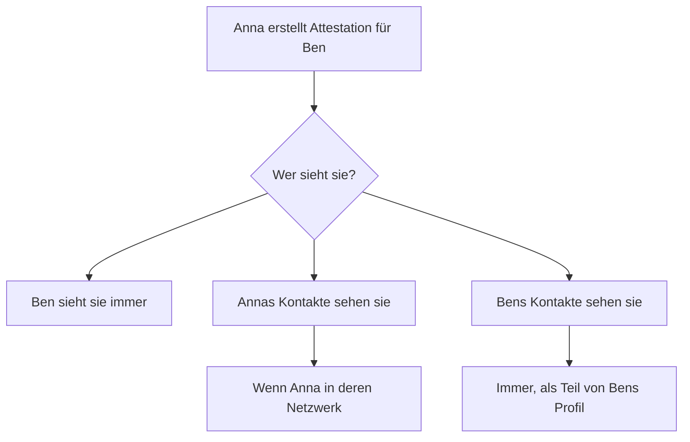

# Attestation-Flow (Nutzer-Perspektive)

> Wie Nutzer Attestationen erstellen und ansehen

## Was ist eine Attestation?

Eine Attestation ist eine **signierte Aussage** einer Person über eine andere Person.

| Verifizierung | Attestation |
|---------------|-------------|
| "Ich habe diese Person getroffen" | "Diese Person hat X getan" |
| Identitätsbestätigung | Vertrauensaufbau |
| Einmalig pro Kontakt | Beliebig viele möglich |
| Binär (ja/nein) | Inhaltlich (was, wann, wo) |

## Hauptflow: Attestation erstellen



## Variante: Schnelle Attestation (Danke-Button)



## Was der Nutzer sieht

### Bens Profil mit Attestation-Button

```
┌─────────────────────────────────┐
│                                 │
│         📷 [Profilbild]         │
│                                 │
│          Ben Schmidt            │
│     "Neu in der Gegend"         │
│                                 │
├─────────────────────────────────┤
│                                 │
│  Verifiziert am 08.01.25 ✅     │
│                                 │
│  12 Attestationen erhalten      │
│                                 │
├─────────────────────────────────┤
│                                 │
│  [ 👍 Danke ]  [ ✍️ Attestation ]│
│                                 │
├─────────────────────────────────┤
│                                 │
│  Letzte Attestationen:          │
│                                 │
│  "Hat beim Umzug geholfen"      │
│  von Tom · vor 3 Tagen          │
│                                 │
│  "Kennt sich mit Fahrrädern     │
│   aus"                          │
│  von Carla · vor 1 Woche        │
│                                 │
│  [ Alle anzeigen ]              │
│                                 │
└─────────────────────────────────┘
```

### Attestation erstellen - Formular

```
┌─────────────────────────────────┐
│                                 │
│  ✍️ Attestation für Ben          │
│                                 │
├─────────────────────────────────┤
│                                 │
│  Was möchtest du bestätigen?    │
│                                 │
│  ┌─────────────────────────┐    │
│  │ Ben hat 3 Stunden im    │    │
│  │ Gemeinschaftsgarten     │    │
│  │ geholfen und dabei die  │    │
│  │ Tomaten gegossen.       │    │
│  │                         │    │
│  └─────────────────────────┘    │
│                                 │
│  Tags (wähle passende):         │
│                                 │
│  [Garten] [Helfen] [Handwerk]   │
│  [Beratung] [Transport] [+Neu]  │
│                                 │
│  Im Kontext einer Gruppe?       │
│                                 │
│  ┌─────────────────────────┐    │
│  │ Gemeinschaftsgarten  ▼  │    │
│  └─────────────────────────┘    │
│                                 │
│  ━━━━━━━━━━━━━━━━━━━━━━━━━━━    │
│                                 │
│  ℹ️ Attestationen können nicht   │
│    zurückgenommen werden.       │
│                                 │
│  [ Attestation erstellen ]      │
│                                 │
└─────────────────────────────────┘
```

### Schnell-Attestation (Danke)

```
┌─────────────────────────────────┐
│                                 │
│  👍 Danke an Ben                 │
│                                 │
├─────────────────────────────────┤
│                                 │
│  Wofür möchtest du danken?      │
│                                 │
│  ┌─────────────────────────┐    │
│  │ 🌱 Hat im Garten        │    │
│  │    geholfen             │    │
│  └─────────────────────────┘    │
│                                 │
│  ┌─────────────────────────┐    │
│  │ 🔧 Hat etwas repariert  │    │
│  └─────────────────────────┘    │
│                                 │
│  ┌─────────────────────────┐    │
│  │ 📦 Hat beim Tragen      │    │
│  │    geholfen             │    │
│  └─────────────────────────┘    │
│                                 │
│  ┌─────────────────────────┐    │
│  │ 💬 War ein gutes        │    │
│  │    Gespräch             │    │
│  └─────────────────────────┘    │
│                                 │
│  ┌─────────────────────────┐    │
│  │ ✍️ Eigenen Text          │    │
│  │    schreiben...         │    │
│  └─────────────────────────┘    │
│                                 │
└─────────────────────────────────┘
```

### Attestation erstellt - Bestätigung

```
┌─────────────────────────────────┐
│                                 │
│         ✅ Attestation          │
│            erstellt!            │
│                                 │
├─────────────────────────────────┤
│                                 │
│  "Ben hat 3 Stunden im          │
│   Gemeinschaftsgarten           │
│   geholfen"                     │
│                                 │
│  Tags: Garten, Helfen           │
│  Gruppe: Gemeinschaftsgarten    │
│                                 │
│  Signiert: 08.01.25 14:32       │
│                                 │
├─────────────────────────────────┤
│                                 │
│  Ben wird benachrichtigt.       │
│                                 │
│  [ Fertig ]                     │
│                                 │
└─────────────────────────────────┘
```

## Attestationen ansehen

### Eigene erhaltene Attestationen

```
┌─────────────────────────────────┐
│                                 │
│  📜 Meine Attestationen         │
│                                 │
│  Filtern: [Alle ▼] [Garten ▼]   │
│                                 │
├─────────────────────────────────┤
│                                 │
│  ┌─────────────────────────┐    │
│  │ "Hat 3 Stunden im       │    │
│  │  Garten geholfen"       │    │
│  │                         │    │
│  │  👩 Anna · 08.01.25      │    │
│  │  🏷️ Garten, Helfen       │    │
│  │  👥 Gemeinschaftsgarten  │    │
│  └─────────────────────────┘    │
│                                 │
│  ┌─────────────────────────┐    │
│  │ "Kennt sich super mit   │    │
│  │  Fahrrädern aus"        │    │
│  │                         │    │
│  │  👴 Tom · 05.01.25       │    │
│  │  🏷️ Handwerk, Fahrrad    │    │
│  └─────────────────────────┘    │
│                                 │
│  ┌─────────────────────────┐    │
│  │ "Hat beim Umzug         │    │
│  │  geholfen - super       │    │
│  │  zuverlässig!"          │    │
│  │                         │    │
│  │  👩 Carla · 01.01.25     │    │
│  │  🏷️ Helfen, Transport    │    │
│  └─────────────────────────┘    │
│                                 │
└─────────────────────────────────┘
```

### Attestationen eines Kontakts ansehen

```
┌─────────────────────────────────┐
│                                 │
│  📜 Attestationen für Ben       │
│                                 │
│  23 Attestationen von           │
│  8 verschiedenen Personen       │
│                                 │
├─────────────────────────────────┤
│                                 │
│  Häufigste Tags:                │
│                                 │
│  ████████████ Helfen (12)       │
│  ████████     Garten (8)        │
│  █████        Handwerk (5)      │
│  ███          Transport (3)     │
│                                 │
├─────────────────────────────────┤
│                                 │
│  Von deinen Kontakten:          │
│                                 │
│  👩 Anna (3 Attestationen)      │
│  👴 Tom (2 Attestationen)       │
│  👩 Carla (1 Attestation)       │
│                                 │
│  Von anderen:                   │
│  👤 5 weitere Personen          │
│                                 │
├─────────────────────────────────┤
│                                 │
│  [ Alle Attestationen ]         │
│                                 │
└─────────────────────────────────┘
```

## Personas

### Kemal attestiert nach Reparatur-Café



### Greta bedankt sich bei Tom



## Regeln und Einschränkungen

### Was Attestationen NICHT können



### Warum nicht löschbar?

| Grund | Erklärung |
|-------|-----------|
| Integrität | Signierte Aussagen sind unveränderlich |
| Vertrauen | Andere verlassen sich auf die Aussage |
| Missbrauch | Sonst könnte man positive Attestationen sammeln und dann löschen |

### Umgang mit falschen Attestationen

Wenn jemand etwas Falsches attestiert hat:

1. **Neue Attestation:** Eine korrigierende Attestation erstellen
2. **Kontakt ausblenden:** Wenn systematisch falsch attestiert wird
3. **Soziale Konsequenz:** Wer falsch attestiert, verliert Glaubwürdigkeit

## Sichtbarkeit von Attestationen



### Sichtbarkeits-Matrix

| Betrachter | Sieht Attestation? | Warum? |
|------------|-------------------|--------|
| Ben (Empfänger) | ✅ Ja | Ist sein Profil |
| Anna (Ersteller) | ✅ Ja | Hat sie erstellt |
| Annas Kontakte | ✅ Ja | Annas Content |
| Bens Kontakte | ✅ Ja | Teil von Bens Profil |
| Fremde | ❌ Nein | Nicht im Netzwerk |
