# Attestation-Flow (Technische Perspektive)

> Wie Attestationen erstellt, signiert und verteilt werden

## Datenmodell

```mermaid
erDiagram
    USER {
        string did PK
        string publicKey
        string name
    }
    
    ATTESTATION {
        string id PK "UUID"
        string fromDid FK "Ersteller"
        string toDid FK "Empfänger"
        string claim "Freitext"
        string contextGroupId FK "Optional"
        datetime createdAt
        string signature
    }
    
    TAG {
        string id PK
        string name
    }
    
    GROUP {
        string did PK
        string name
    }
    
    USER ||--o{ ATTESTATION : "erstellt"
    USER ||--o{ ATTESTATION : "empfängt"
    ATTESTATION }o--o{ TAG : "hat"
    ATTESTATION }o--o| GROUP : "im Kontext von"
```



## Attestation-Dokument Struktur

```json
{
  "@context": "https://w3id.org/weboftrust/v1",
  "type": "Attestation",
  "id": "urn:uuid:550e8400-e29b-41d4-a716-446655440000",
  "from": "did:wot:anna123",
  "to": "did:wot:ben456",
  "claim": "Hat 3 Stunden im Gemeinschaftsgarten geholfen",
  "tags": ["garten", "helfen"],
  "context": "did:wot:group:gemeinschaftsgarten",
  "createdAt": "2025-01-08T14:32:00Z",
  "proof": {
    "type": "Ed25519Signature2020",
    "verificationMethod": "did:wot:anna123#key-1",
    "proofPurpose": "assertionMethod",
    "proofValue": "z58DAdFfa9SkqZMVPxAQpic7ndTEcnUn..."
  }
}
```

## Hauptflow: Attestation erstellen


## Sequenzdiagramm: Attestation erstellen und verteilen


## Detailflow: Signatur erstellen


### Kanonisierung

Bevor signiert wird, muss das JSON kanonisiert werden:

1. Keys alphabetisch sortieren
2. Keine Whitespace ausser in Strings
3. UTF-8 Encoding

```javascript
const canonical = JSON.stringify(doc, Object.keys(doc).sort());
const hash = sha256(canonical);
const signature = ed25519.sign(hash, privateKey);
const proofValue = base58.encode(signature);
```

## Detailflow: Signatur verifizieren


## Verschluesselung und Verteilung

### Wer bekommt die Attestation?


### Item-Key Verschluesselung

Attestationen nutzen das gleiche Verschluesselungsschema wie andere Items:


## Tags und Suche

### Tag-Verwaltung


### Vordefinierte Tags

```json
{
  "predefinedTags": [
    {"id": "helfen", "emoji": "🤝", "label": "Helfen"},
    {"id": "garten", "emoji": "🌱", "label": "Garten"},
    {"id": "handwerk", "emoji": "🔧", "label": "Handwerk"},
    {"id": "transport", "emoji": "🚗", "label": "Transport"},
    {"id": "beratung", "emoji": "💬", "label": "Beratung"},
    {"id": "kochen", "emoji": "🍳", "label": "Kochen"},
    {"id": "kinderbetreuung", "emoji": "👶", "label": "Kinderbetreuung"},
    {"id": "technik", "emoji": "💻", "label": "Technik"}
  ]
}
```

## Gruppen-Kontext

### Attestation mit Gruppen-Kontext


### Gruppen-Kontext Bedeutung

| Mit Kontext | Ohne Kontext |
|-------------|--------------|
| Attestation ist im Rahmen der Gruppe entstanden | Allgemeine Attestation |
| Sichtbar fuer alle Gruppen-Mitglieder | Nur fuer direkte Kontakte |
| Kann in Gruppen-Statistiken auftauchen | Nur in persoenlichem Profil |

## Benachrichtigungen

### Benachrichtigung fuer Empfaenger

```json
{
  "type": "attestation_received",
  "from": "did:wot:anna123",
  "fromName": "Anna Mueller",
  "attestationId": "urn:uuid:550e8400...",
  "preview": "Hat 3 Stunden im Gemeinschaftsgarten geholfen",
  "createdAt": "2025-01-08T14:32:00Z"
}
```

### Benachrichtigungs-Flow


## Validierung

### Eingabe-Validierung

| Feld | Validierung |
|------|-------------|
| claim | Min 5 Zeichen, Max 500 Zeichen |
| tags | Min 0, Max 5 Tags |
| context | Muss existierende Gruppe sein oder leer |

### Signatur-Validierung beim Empfang


## Speicher-Schema

### Lokale Datenbank

```sql
CREATE TABLE attestations (
    id TEXT PRIMARY KEY,
    from_did TEXT NOT NULL,
    to_did TEXT NOT NULL,
    claim TEXT NOT NULL,
    context_group_id TEXT,
    created_at DATETIME NOT NULL,
    signature TEXT NOT NULL,
    raw_json TEXT NOT NULL,
    received_at DATETIME DEFAULT CURRENT_TIMESTAMP
);

CREATE TABLE attestation_tags (
    attestation_id TEXT,
    tag_id TEXT,
    PRIMARY KEY (attestation_id, tag_id)
);

CREATE TABLE tags (
    id TEXT PRIMARY KEY,
    name TEXT NOT NULL,
    emoji TEXT,
    is_predefined BOOLEAN DEFAULT FALSE
);

CREATE INDEX idx_attestations_to ON attestations(to_did);
CREATE INDEX idx_attestations_from ON attestations(from_did);
CREATE INDEX idx_attestations_context ON attestations(context_group_id);
```

## Abfragen

### Attestationen fuer eine Person

```javascript
// Alle Attestationen die Ben empfangen hat
const attestations = await db.attestations
  .where('to_did')
  .equals(ben.did)
  .toArray();
```

### Attestationen nach Tag filtern

```javascript
// Alle Attestationen mit Tag "garten"
const gartenAttestations = await db.attestation_tags
  .where('tag_id')
  .equals('garten')
  .toArray();
```

### Attestationen im Gruppen-Kontext

```javascript
// Alle Attestationen im Kontext der Gartengruppe
const groupAttestations = await db.attestations
  .where('context_group_id')
  .equals('did:wot:group:gemeinschaftsgarten')
  .toArray();
```

## Sicherheitsueberlegungen

### Spam-Schutz

| Massnahme | Beschreibung |
|-----------|--------------|
| Nur fuer Kontakte | Attestationen nur fuer verifizierte Kontakte |
| Rate Limiting | Max 10 Attestationen pro Stunde (Client-seitig) |
| Soziale Kontrolle | Wer spammt verliert Glaubwuerdigkeit |

### Manipulation

| Angriff | Schutz |
|---------|--------|
| Attestation faelschen | Signatur mit Private Key des Erstellers |
| Attestation aendern | Jede Aenderung invalidiert Signatur |
| Attestation loeschen | Empfaenger hat eigene Kopie |
| Falsche Behauptung | Nur soziale Konsequenzen moeglich |

### Unveraenderlichkeit

Attestationen sind bewusst **unveraenderlich**:

1. **Signatur:** Jede Aenderung wuerde die Signatur brechen
2. **Verteilt:** Mehrere Kopien existieren bei verschiedenen Nutzern
3. **Design:** Eine Aussage ueber die Vergangenheit kann nicht ungeschehen gemacht werden

Bei Fehlern: Neue korrigierende Attestation erstellen.
