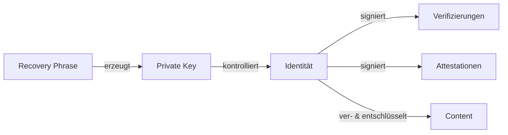

# Sicherheit

> Sicherheitskonzepte und Best Practices für das Web of Trust

## Inhalt

| Dokument | Beschreibung |
|----------|--------------|
| [Threat Model](threat-model.md) | Angriffsvektoren und Mitigationen |
| [Privacy](privacy.md) | Datenschutz-Überlegungen |
| [Best Practices](best-practices.md) | Implementierungsrichtlinien |

---

## Sicherheitsprinzipien

### 1. Zero Trust Server

```
┌─────────────────────────────────────────────────────────────┐
│                                                             │
│  Der Server ist NICHT vertrauenswürdig:                     │
│                                                             │
│  • Sieht nur verschlüsselte Daten                           │
│  • Kann Inhalte nicht lesen                                 │
│  • Kann Identitäten nicht fälschen (Signaturen)             │
│  • Kann gelöschte Daten nicht wiederherstellen              │
│                                                             │
│  Selbst bei Server-Kompromittierung:                        │
│  ✅ Inhalte bleiben verschlüsselt                           │
│  ✅ Identitäten können nicht gestohlen werden               │
│  ✅ Verifizierungen können nicht gefälscht werden           │
│                                                             │
└─────────────────────────────────────────────────────────────┘
```

### 2. Kryptografische Identität



### 3. Dezentrale Verifizierung

```
┌─────────────────────────────────────────────────────────────┐
│                                                             │
│  Keine zentrale Autorität:                                  │
│                                                             │
│  • Verifizierung = direkt zwischen zwei Personen            │
│  • Kein Admin kann Verifizierungen erstellen/löschen        │
│  • Attestationen sind kryptografisch an Ersteller gebunden  │
│                                                             │
└─────────────────────────────────────────────────────────────┘
```

---

## Sicherheitseigenschaften

| Eigenschaft | Status | Beschreibung |
|-------------|--------|--------------|
| **End-to-End-Verschlüsselung** | ✅ | Server sieht nur Ciphertext |
| **Authentizität** | ✅ | Signaturen verifizieren Absender |
| **Integrität** | ✅ | Signaturen schützen vor Manipulation |
| **Forward Secrecy** | ⚠️ | Abhängig von Protokollwahl |
| **Post-Compromise Security** | ⚠️ | Abhängig von Protokollwahl |
| **Dezentralität** | ✅ | Keine zentrale Autorität |
| **Offline-Fähigkeit** | ✅ | Alle Operationen lokal möglich |

---

## Weiterführend

- [Threat Model](threat-model.md) - Detaillierte Risikoanalyse
- [Privacy](privacy.md) - Datenschutz und Metadaten
- [Best Practices](best-practices.md) - Implementierungshinweise
